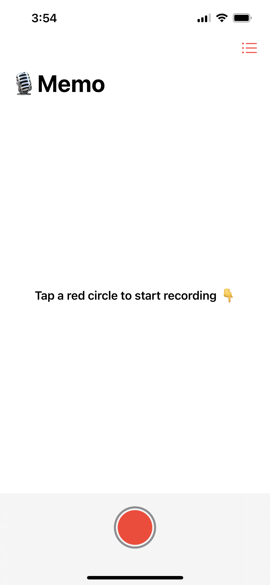
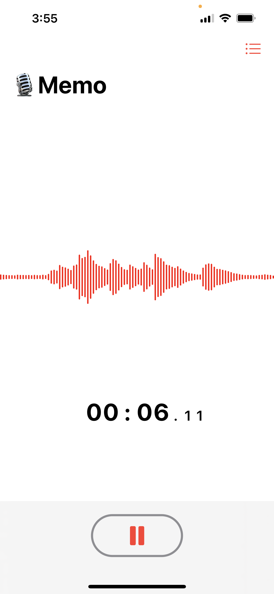
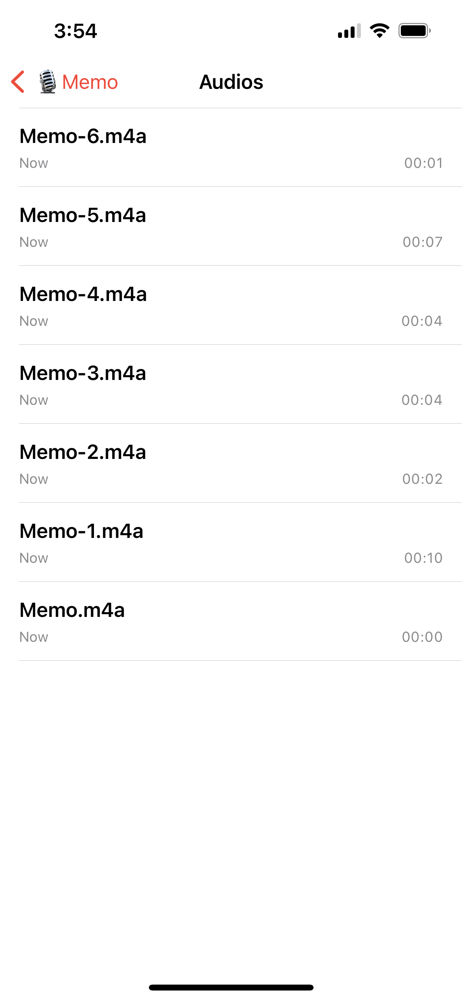

# 🎙 Memo

Memo is a basic recording application built with AVFoundation and SwiftUI that supports recording and playing audios.

## 📱 Previews
<table>
<tr>
<td align="center" width="30%"></td>
<td align="center" width="30%"></td>
<td align="center" width="30%"></td>
</tr>
</table>

## 🔨 Build & Run
To get started, go to **Terminal** and run the following commands to clone and open the project.
```
> git clone https://github.com/dscyrescotti/Memo.git
> cd Memo && xed .
```
After seeing the project open, run the project by either using **⌘R** (Command+R) or clicking **Run** button in the project toolbar.
> Don't forget to run on the real device.

## 📦 Tech Stack
- AVFoundation
- SwiftUI
- Combine
- Swift Concurrency

## ✍️ Author
Scotti | [@dscyrescotti](https://twitter.com/dscyrescotti)
<p>
<a href="https://twitter.com/dscyrescotti">

</a>
&nbsp;
<a href="https://github.com/dscyrescotti">

</a>
</p>